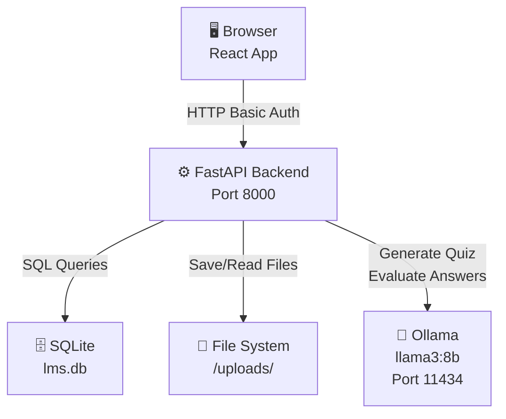
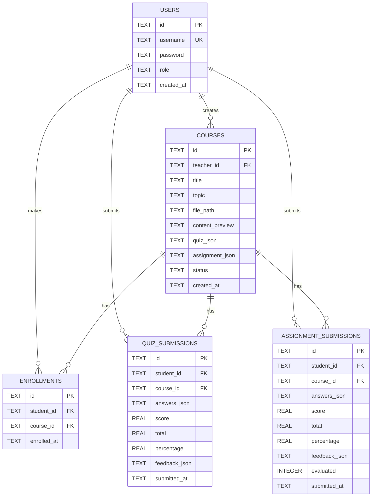
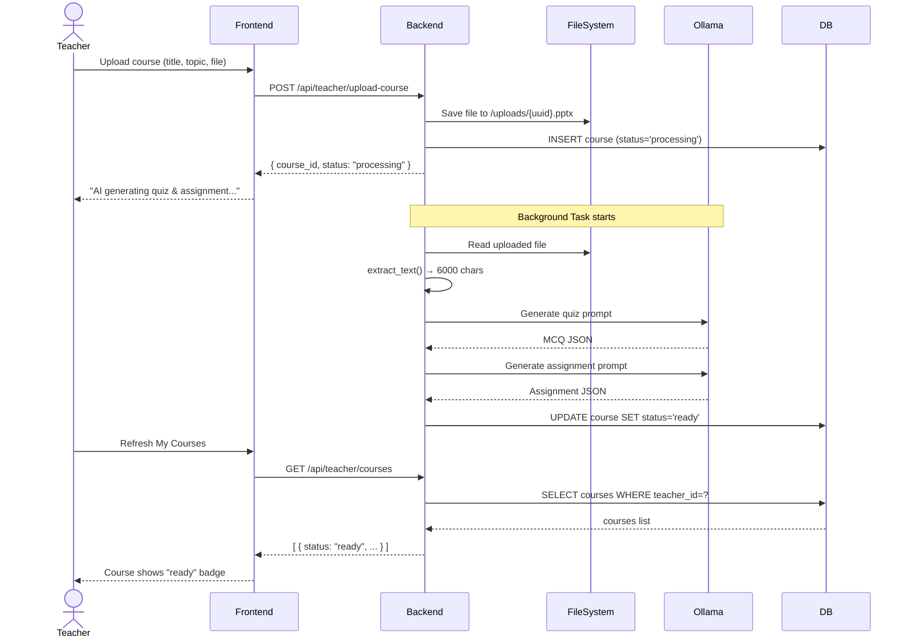
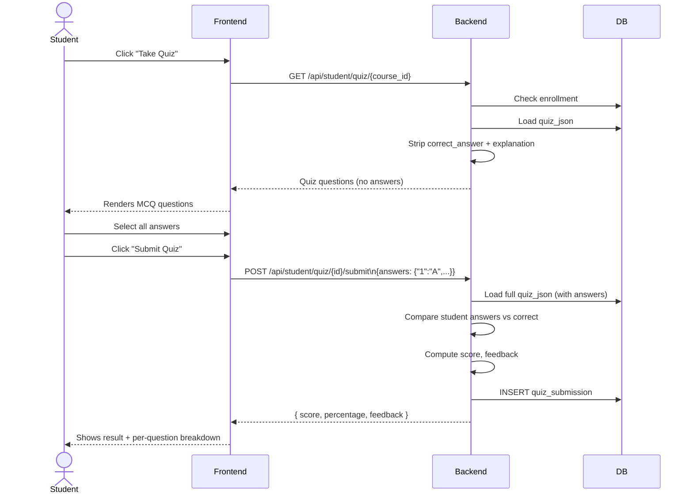
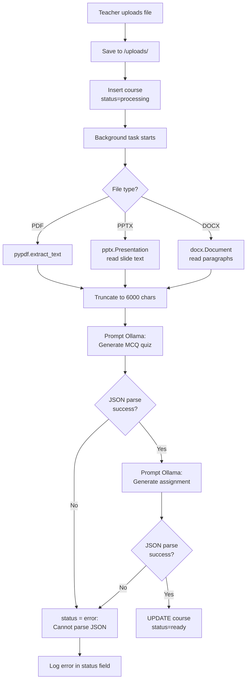

# AI-Based LMS System — Complete Enterprise Blueprint
### Senior Solution Architect Analysis · Product Manager Review · Full-Stack Technical Guide

---

## TABLE OF CONTENTS

1. Executive Summary & Project Overview
2. Current System Analysis (What Exists)
3. Requirement Gaps & Missing Features
4. User Roles, Permissions & Workflows
5. Complete System Flow
6. Database Architecture & ER Diagram
7. Frontend Architecture
8. Backend Architecture
9. API Integration Guide (Every Endpoint)
10. System Design (High-Level & Low-Level)
11. Security Analysis
12. Development Roadmap (6 Phases)
13. Frontend Development Checklist
14. Potential Improvements & Future Enhancements

---

## 1. EXECUTIVE SUMMARY & PROJECT OVERVIEW

### What Is This System?

This is an **AI-Powered Learning Management System (LMS)** that uses a locally-running Large Language Model (Ollama / llama3:8b) to:

- Automatically generate **quizzes** (MCQ) from course materials uploaded by teachers
- Automatically generate **written assignments** from the same materials
- **Auto-grade MCQ** quizzes instantly (no AI needed — answers are embedded)
- **AI-grade written assignments** using Ollama, triggered by the teacher
- **Adapt difficulty** to each student based on their average quiz score

### Technology Stack

| Layer | Technology |
|-------|-----------|
| Backend | Python 3.x + FastAPI |
| Frontend | React 19 + Vite |
| Database | SQLite (production-ready swap: PostgreSQL) |
| AI Engine | Ollama (local) running llama3:8b |
| Auth | HTTP Basic Auth (credentials in every request) |
| File Storage | Local filesystem (`/uploads/` directory) |
| Document Parsing | pypdf, python-pptx, python-docx |

### Business Value

A teacher uploads a PDF or PowerPoint once. The AI reads it and creates a full assessment suite automatically. Students get instant quiz feedback. Written assignments are evaluated by AI with strengths, improvements, and detailed scoring — removing manual grading overhead.

---

## 2. CURRENT SYSTEM ANALYSIS

### What Has Been Built

#### Backend (main.py — ~870 lines)

| Component | Status | Quality |
|-----------|--------|---------|
| User registration & login | ✅ Done | Basic |
| Teacher: upload course | ✅ Done | Good |
| Teacher: list own courses | ✅ Done | Good |
| Teacher: view student results | ✅ Done | Good |
| Teacher: trigger AI grading | ✅ Done | Good |
| Student: browse courses | ✅ Done | Good |
| Student: enroll in course | ✅ Done | Good |
| Student: take quiz | ✅ Done | Good |
| Student: submit assignment | ✅ Done | Good |
| Student: view profile/history | ✅ Done | Good |
| Background task for AI generation | ✅ Done | Good |
| PDF / PPTX / DOCX text extraction | ✅ Done | Good |
| JSON parsing from AI output | ✅ Done | Good |

#### Frontend (App.jsx — 951 lines, single file)

| Screen | Status |
|--------|--------|
| Auth (login/register) | ✅ Done |
| Teacher portal (courses list) | ✅ Done |
| Teacher portal (upload form) | ✅ Done |
| Teacher portal (student results) | ✅ Done |
| Student portal (course browse) | ✅ Done |
| Student portal (quiz attempt) | ✅ Done |
| Student portal (assignment attempt) | ✅ Done |
| Student portal (quiz results) | ✅ Done |
| Student portal (assignment results) | ✅ Done |
| Student portal (profile/history) | ✅ Done |

#### Database (5 tables)
`users` → `courses` → `enrollments` → `quiz_submissions` → `assignment_submissions`

---

## 3. REQUIREMENT GAPS & MISSING FEATURES

> These are items that a real production LMS **needs** but the current system does **not have**.

### 🔴 Critical Security Gaps

| Gap | Risk | Fix |
|-----|------|-----|
| Passwords stored in **plain text** | Data breach exposes all passwords | Use `bcrypt` or `argon2` |
| Auth uses **HTTP Basic** (password sent every request) | Man-in-the-middle interception | Replace with JWT tokens |
| `allow_origins=["*"]` in CORS | Any website can call the API | Restrict to known origins |
| No rate limiting on login | Brute-force attacks | Add `slowapi` rate limiter |
| No input length limits | DoS via huge uploads | Validate file size, string lengths |
| Password stored in `sessionStorage` client-side | XSS can steal credentials | Use JWT in httpOnly cookie |

### 🟡 Missing Business Features

| Feature | Why It Matters |
|---------|---------------|
| No email verification | Anyone can register with a fake account |
| No course **deletion or edit** by teacher | Content mistakes cannot be corrected |
| No student can **retry** quiz or assignment | One failed attempt = permanent record |
| No course **search or filter** | With 100+ courses, browsing is impossible |
| No **file preview** for students | Students cannot read the course material |
| No **Admin role** | No one can manage users or moderate content |
| No **notifications** | Students don't know when grading is done |
| No **quiz timer** | No time-pressure academic integrity |
| Difficulty is computed only from quiz % | Assignment scores are ignored |
| No **pagination** on any list | Will break with 1000+ courses or students |

### 🟠 Technical Debt

| Issue | Impact |
|-------|--------|
| All frontend in one 951-line file | Hard to maintain, test, or extend |
| No error logging | Production bugs are invisible |
| SQLite with raw `sqlite3` module | No connection pooling, migrations, or ORM |
| Background tasks use separate DB connections | Risk of race conditions |
| Ollama timeout is 600s | Requests can hang for 10 minutes |
| `compute_difficulty` only used in profile | Not reflected when generating new quizzes per-student |
| No health check for Ollama availability | Upload succeeds but AI silently fails |

---

## 4. USER ROLES, PERMISSIONS & WORKFLOWS

```
System Roles
├── Guest (not logged in)
│   └── Can: register, login
├── Teacher (role = 'teacher')
│   ├── Can: upload courses (PDF/PPTX/DOCX)
│   ├── Can: view own courses and their status
│   ├── Can: view enrolled students + their scores
│   └── Can: trigger AI evaluation of assignments
└── Student (role = 'student')
    ├── Can: browse all "ready" courses
    ├── Can: enroll in any ready course
    ├── Can: take quiz for enrolled course (once)
    ├── Can: submit assignment for enrolled course (once)
    └── Can: view own profile, scores, feedback
```

### Permission Matrix

| Action | Guest | Student | Teacher |
|--------|-------|---------|---------|
| Register | ✅ | ✅ | ✅ |
| Login | ✅ | ✅ | ✅ |
| View available courses | ❌ | ✅ | ❌ |
| Enroll in course | ❌ | ✅ | ❌ |
| Take quiz | ❌ | ✅ (enrolled only) | ❌ |
| Submit assignment | ❌ | ✅ (enrolled only) | ❌ |
| View own profile | ❌ | ✅ | ❌ |
| Upload course | ❌ | ❌ | ✅ |
| View student results | ❌ | ❌ | ✅ (own courses) |
| Trigger AI grading | ❌ | ❌ | ✅ (own courses) |

---

## 5. COMPLETE SYSTEM FLOW

### 5.1 System Start-Up Flow

```
Developer starts system:
  1. pip install -r requirements.txt
  2. ollama serve (separate terminal)
  3. ollama pull llama3:8b
  4. uvicorn main:app --reload --port 8000
       └── init_db() runs automatically
           └── Creates 5 tables if not exist
  5. npm run dev (frontend, port 5173)
```

### 5.2 Teacher Journey (Full Walkthrough)

```
[Step 1] Open browser → http://localhost:5173
         → AuthScreen renders
         → Teacher clicks "Register" tab
         → Fills username, password, selects "Teacher"
         → Clicks "Create account"
         → POST /api/auth/register → 200 OK
         → Redirected to login tab
         → Signs in → POST /api/auth/login → returns user_id, username, role
         → App stores {username, password, role} in sessionStorage
         → TeacherPortal renders

[Step 2] Teacher clicks "Upload Course" tab
         → Form: Course Title, Topic, File input
         → Selects a .pptx file from disk
         → Clicks Submit
         → FormData POST to /api/teacher/upload-course
         → Backend saves file to /uploads/{uuid}.pptx
         → Inserts course row with status='processing'
         → Spawns background task:
              extract_text() → reads PPTX slide text
              generate_quiz() → sends text to Ollama → receives MCQ JSON
              generate_assignment() → sends text to Ollama → receives assignment JSON
              UPDATE courses SET status='ready', quiz_json=..., assignment_json=...
         → Returns immediately: { course_id, status: "processing" }
         → Frontend shows success message

[Step 3] Teacher clicks "My Courses" tab
         → GET /api/teacher/courses
         → Sees list with status badges: "processing" or "ready"
         → Waits until status = "ready" (no auto-refresh, must manually reload)

[Step 4] Teacher clicks on a ready course → "View students"
         → GET /api/teacher/course/{id}/students
         → Sees table: student username, quiz score, assignment score, evaluation status

[Step 5] When assignment submissions exist, teacher clicks "Evaluate assignments (AI)"
         → POST /api/teacher/course/{id}/evaluate-assignments
         → Backend finds all unevaluated submissions
         → For each: sends task + student answer to Ollama
         → Ollama returns score, feedback, strengths, improvements
         → UPDATE assignment_submissions SET score=..., evaluated=1
         → Students can now see their results
```

### 5.3 Student Journey (Full Walkthrough)

```
[Step 1] Register as student → Login → StudentPortal renders
         → "Courses" tab loads automatically
         → GET /api/student/courses → lists all ready courses

[Step 2] Student finds a course they want → clicks "Enroll"
         → POST /api/student/enroll/{course_id}
         → Enrollment record created
         → Button changes to "Take Quiz" and "Assignment"

[Step 3] Student clicks "Take Quiz"
         → App switches to "Activity" tab, renders QuizView
         → GET /api/student/quiz/{course_id}
         → Backend returns quiz WITHOUT correct_answer or explanation
             (these are stripped server-side for integrity)
         → Student sees MCQ questions with A/B/C/D radio buttons
         → Selects answers → progress counter shows "2/3 answered"
         → Clicks "Submit Quiz" (only enabled when all answered)
         → POST /api/student/quiz/{course_id}/submit {answers: {"1":"A","2":"C","3":"B"}}
         → Backend grades locally (compares against stored answers)
         → Returns: score, total, percentage, per-question feedback
         → QuizResultView renders showing score, pass/fail, explanations

[Step 4] Student clicks "Assignment"
         → GET /api/student/assignment/{course_id}
         → Sees assignment title, description, 2-3 written tasks
         → Types answers in textareas
         → POST /api/student/assignment/{course_id}/submit
         → Backend stores answers, sets evaluated=0
         → Student sees: "Submitted. Awaiting AI evaluation."

[Step 5] After teacher triggers evaluation:
         → Student opens their Profile tab
         → GET /api/student/profile
         → Sees: avg_score, level (low/medium/hard), quiz history, assignment history
         → Assignment result shows: score per task, feedback, strengths, improvements

[Step 6] Level is auto-computed each time profile is loaded:
         avg_score < 40%  → level = "low"
         avg_score 40-70% → level = "medium"
         avg_score > 70%  → level = "hard"
         NOTE: This level is display-only. Quizzes are still generated at "medium" for everyone.
```

### 5.4 Data Flow Diagram

```
User Browser
    │
    │  HTTP Requests (Basic Auth header on every request)
    ▼
FastAPI Backend (port 8000)
    │
    ├─── SQLite Database (lms.db)
    │      users, courses, enrollments,
    │      quiz_submissions, assignment_submissions
    │
    ├─── File System (/uploads/)
    │      Stores uploaded PPTX, PDF, DOCX files
    │
    └─── Ollama API (http://localhost:11434)
           llama3:8b model
           Used for: quiz generation, assignment generation,
                     assignment evaluation
```

---

## 6. DATABASE ARCHITECTURE

### Entity Relationship Diagram

```
┌─────────────────────────────────────────────────────────────┐
│                         USERS                               │
│  id (PK, UUID)  username (UNIQUE)  password  role  created_at│
└────────────────────────┬────────────────────────────────────┘
                         │
          ┌──────────────┴──────────────┐
          │                             │
          │ teacher_id (FK)             │ student_id (FK)
          ▼                             ▼
┌──────────────────────┐    ┌─────────────────────────────────┐
│       COURSES        │    │          ENROLLMENTS            │
│  id (PK, UUID)       │◄───│  id (PK, UUID)                  │
│  teacher_id (FK)     │    │  student_id (FK → users.id)     │
│  title               │    │  course_id  (FK → courses.id)   │
│  topic               │    │  enrolled_at                    │
│  file_path           │    │  UNIQUE(student_id, course_id)  │
│  content_preview     │    └─────────────────────────────────┘
│  quiz_json (TEXT)    │
│  assignment_json (TEXT)│            student_id (FK)
│  status              │    ┌─────────────────────────────────┐
│  created_at          │◄───│      QUIZ_SUBMISSIONS           │
└──────────────────────┘    │  id (PK, UUID)                  │
          ▲                 │  student_id (FK → users.id)     │
          │ course_id (FK)  │  course_id  (FK → courses.id)   │
          │                 │  answers_json                   │
┌─────────┴───────────────┐ │  score / total / percentage     │
│  ASSIGNMENT_SUBMISSIONS │ │  feedback_json                  │
│  id (PK, UUID)          │ │  submitted_at                   │
│  student_id (FK)        │ └─────────────────────────────────┘
│  course_id  (FK)        │
│  answers_json           │
│  score / total / pct    │
│  feedback_json          │
│  evaluated (0 or 1)     │
│  submitted_at           │
└─────────────────────────┘
```

### Table Descriptions

**users** — Every person in the system. Role field determines Teacher vs Student access.

**courses** — Created by teachers. Holds the uploaded file path and the AI-generated quiz and assignment as JSON text blobs. Status moves: `processing` → `ready` (or `error`).

**enrollments** — Junction table connecting students to courses. A student can enroll in many courses; a course can have many students. The UNIQUE constraint prevents double-enrollment.

**quiz_submissions** — One row per (student, course) pair. Once submitted, cannot resubmit (enforced by checking for existing row). Graded instantly at submission time.

**assignment_submissions** — Same structure but grading is async. `evaluated=0` means AI hasn't scored it yet. `evaluated=1` means teacher triggered evaluation and feedback is stored in `feedback_json`.

### Data Stored as JSON Blobs (Design Note)

The `quiz_json` and `assignment_json` columns store entire JSON structures as TEXT. This is a trade-off:

**Pros:** Simple, no extra tables, easy to retrieve the whole quiz at once.

**Cons:** Can't query individual questions, can't index, can't enforce referential integrity on questions, hard to edit one question without rewriting the whole blob.

For a production system, these should be normalized into separate `questions` and `tasks` tables.

### Data Lifecycle

```
Course lifecycle:
  INSERT (status=processing) → BACKGROUND TASK runs → UPDATE (status=ready)

Quiz lifecycle:
  Course ready → Student enrolled → Student fetches quiz (answers stripped) →
  Student submits → Score computed → Row inserted

Assignment lifecycle:
  Course ready → Student enrolled → Student fetches assignment →
  Student submits (evaluated=0) → Teacher triggers grading →
  BACKGROUND TASK runs Ollama → Row updated (evaluated=1, score, feedback)
```

---

## 7. FRONTEND ARCHITECTURE

### Current State

The entire frontend lives in **one file: App.jsx (951 lines)**. This is fine for a prototype but will become unmaintainable.

### Recommended Folder Structure

```
lms-frontend/
├── src/
│   ├── main.jsx                  ← Entry point (unchanged)
│   ├── App.jsx                   ← Only routing logic
│   │
│   ├── api/
│   │   ├── client.js             ← apiFetch, authHeader helpers
│   │   ├── auth.js               ← register(), login()
│   │   ├── teacher.js            ← uploadCourse(), getCourses(), getStudents(), evaluateAll()
│   │   └── student.js            ← getCourses(), enroll(), getQuiz(), submitQuiz(),
│   │                                getAssignment(), submitAssignment(), getProfile()
│   │
│   ├── hooks/
│   │   ├── useAuth.js            ← user state, login, logout
│   │   ├── useCourses.js         ← teacher or student course lists
│   │   └── useProfile.js        ← student profile data
│   │
│   ├── components/               ← Pure UI components (no API calls)
│   │   ├── Badge.jsx
│   │   ├── Button.jsx
│   │   ├── Card.jsx
│   │   ├── Alert.jsx
│   │   ├── Spinner.jsx
│   │   ├── ScorePill.jsx
│   │   └── NavBar.jsx
│   │
│   ├── pages/
│   │   ├── AuthPage.jsx          ← Login + Register
│   │   ├── teacher/
│   │   │   ├── TeacherLayout.jsx ← Nav + tab routing
│   │   │   ├── CourseList.jsx    ← My Courses tab
│   │   │   ├── UploadCourse.jsx  ← Upload tab
│   │   │   └── StudentResults.jsx← Students tab
│   │   └── student/
│   │       ├── StudentLayout.jsx ← Nav + tab routing
│   │       ├── CourseBrowser.jsx ← Courses tab
│   │       ├── QuizView.jsx      ← Quiz attempt
│   │       ├── QuizResult.jsx    ← Quiz result
│   │       ├── AssignmentView.jsx← Assignment attempt
│   │       ├── AssignmentResult.jsx← Assignment result
│   │       └── ProfilePage.jsx   ← Profile tab
│   │
│   └── styles/
│       ├── index.css             ← Global reset, CSS variables
│       └── components.css        ← Shared component styles
```

### State Management Strategy

The current approach uses local `useState` per component. For this system size, this is **appropriate**. Context API would be added for:

```javascript
// AuthContext — user object + login/logout across all pages
// No Redux/Zustand needed at current scale
```

### Routing Strategy

Currently: tab-based navigation (no URL routing). Recommended upgrade:

```
/ → redirect based on role
/login
/register
/teacher/courses
/teacher/upload
/teacher/courses/:id/students
/student/courses
/student/courses/:id/quiz
/student/courses/:id/assignment
/student/profile
```

Use `react-router-dom` v6. This enables deep-linking and browser back button support.

### Form Handling & Validation

| Form | Required Fields | Validation |
|------|----------------|------------|
| Register | username, password, role | username min 3 chars, password min 6 chars |
| Login | username, password | non-empty |
| Upload Course | title, topic, file | file must be .pdf/.pptx/.docx, max 10MB |
| Quiz Submit | all questions answered | count answers == total questions |
| Assignment Submit | all tasks answered | each answer non-empty, min 10 chars |

### Error Handling Strategy

```
Every API call should handle:
  - Network error (no internet / server down)
  - 400 Bad Request (validation error from server)
  - 401 Unauthorized (expired/wrong credentials)
  - 403 Forbidden (wrong role)
  - 404 Not Found
  - 500 Server Error (Ollama down, parsing failed)

Current state: catches e.message and shows in Alert component — OK but basic.
Recommended: Central error boundary + toast notifications
```

---

## 8. BACKEND ARCHITECTURE

### Module Breakdown

```
main.py is structured in clear sections:
  1. CONFIG (constants)
  2. DATABASE (init_db, get_db)
  3. AUTH HELPERS (get_user, require_auth, require_teacher, require_student)
  4. DOCUMENT PARSING (extract_text for PDF/PPTX/DOCX)
  5. OLLAMA HELPERS (ollama_generate, parse_json_response)
  6. AI GENERATION (generate_quiz, generate_assignment)
  7. GRADING (evaluate_quiz_submission, evaluate_assignment_with_ollama)
  8. BACKGROUND TASK (process_course_background)
  9. PYDANTIC MODELS (request schemas)
  10. AUTH ROUTES
  11. TEACHER ROUTES
  12. STUDENT ROUTES
```

### Recommended Refactoring (Production)

```
backend/
├── main.py              ← FastAPI app creation + router mounting
├── config.py            ← All constants (OLLAMA_URL, DB_PATH, etc.)
├── database.py          ← init_db, get_db
├── models.py            ← Pydantic request/response models
├── auth.py              ← Auth helpers, JWT utils
├── routers/
│   ├── auth.py          ← /api/auth/* routes
│   ├── teacher.py       ← /api/teacher/* routes
│   └── student.py       ← /api/student/* routes
└── services/
    ├── document.py      ← extract_text
    ├── ollama.py        ← ollama_generate, parse_json_response
    ├── quiz.py          ← generate_quiz, evaluate_quiz_submission
    └── assignment.py    ← generate_assignment, evaluate_assignment_with_ollama
```

---

## 9. API INTEGRATION GUIDE

### Authentication

All protected endpoints require HTTP Basic Auth:
```
Authorization: Basic base64(username:password)
```
Frontend helper:
```javascript
function authHeader(user) {
  return { Authorization: "Basic " + btoa(`${user.username}:${user.password}`) };
}
```

---

### AUTH ENDPOINTS

#### POST /api/auth/register

**Purpose:** Create a new user account.

**Request Body:**
```json
{ "username": "john", "password": "secret123", "role": "student" }
```

**Success Response (200):**
```json
{ "message": "Registered successfully", "user_id": "uuid", "role": "student" }
```

**Error Responses:**
```json
400: { "detail": "Username already taken" }
400: { "detail": "role must be 'teacher' or 'student'" }
```

**Frontend Usage:**
```javascript
const res = await fetch(`${API}/auth/register`, {
  method: "POST",
  headers: { "Content-Type": "application/json" },
  body: JSON.stringify({ username, password, role })
});
```

---

#### POST /api/auth/login

**Purpose:** Verify credentials, get user info for session.

**Request Body:**
```json
{ "username": "john", "password": "secret123" }
```

**Success Response (200):**
```json
{ "user_id": "uuid", "username": "john", "role": "student" }
```

**Error Response:**
```json
401: { "detail": "Invalid credentials" }
```

**⚠️ Security Note:** The login endpoint doesn't return a token. The password must be sent with every subsequent request. This is a critical gap — in production, implement JWT.

---

### TEACHER ENDPOINTS

#### POST /api/teacher/upload-course

**Purpose:** Upload course material → triggers AI quiz+assignment generation.

**Request:** `multipart/form-data`
```
title = "Introduction to Python"
topic = "Python Programming Basics"
file  = [binary file: .pdf / .pptx / .docx]
```

**Success Response (200):**
```json
{
  "message": "Course uploaded. AI is generating quiz & assignment in the background.",
  "course_id": "uuid",
  "status": "processing"
}
```

**What happens in the background:**
```
1. extract_text(file_path)         → extracts up to 6000 chars of text
2. generate_quiz(content, topic)   → Ollama → MCQ JSON
3. generate_assignment(...)        → Ollama → Assignment JSON
4. UPDATE courses SET status='ready'
```

**Error Scenarios:**
- Ollama is offline → status becomes `"error: Connection refused"`
- File too large or unreadable → `"error: ..."` message stored in status
- AI returns malformed JSON → `"error: Cannot parse JSON..."`

---

#### GET /api/teacher/courses

**Purpose:** List all courses created by this teacher.

**Response (200):**
```json
[
  {
    "id": "uuid",
    "title": "Intro to Python",
    "topic": "Python Basics",
    "status": "ready",
    "created_at": "2026-06-10T14:30:00"
  }
]
```

---

#### GET /api/teacher/course/{course_id}/students

**Purpose:** See enrolled students and their quiz/assignment scores.

**Response (200):**
```json
[
  {
    "username": "alice",
    "quiz_score": 2,
    "quiz_total": 3,
    "quiz_pct": 66.7,
    "quiz_submitted": "2026-06-10T15:00:00",
    "assign_score": 75,
    "assign_total": 100,
    "assign_pct": 75.0,
    "assign_evaluated": 1
  }
]
```

---

#### POST /api/teacher/course/{course_id}/evaluate-assignments

**Purpose:** Trigger Ollama AI to grade all unevaluated assignment submissions.

**Response (200):**
```json
{ "message": "Evaluating 5 submissions in background." }
```

**What happens in background:**
```
For each unevaluated submission:
  1. Load assignment tasks from courses.assignment_json
  2. Load student answers from assignment_submissions.answers_json
  3. For each task: prompt Ollama with task + answer → get score + feedback
  4. UPDATE assignment_submissions SET score=..., evaluated=1
```

---

### STUDENT ENDPOINTS

#### GET /api/student/courses

**Purpose:** Browse all available (ready) courses with enrollment status.

**Response (200):**
```json
[
  {
    "id": "uuid",
    "title": "Intro to Python",
    "topic": "Python Basics",
    "status": "ready",
    "created_at": "2026-06-10T14:30:00",
    "enrolled": 1
  }
]
```
`enrolled: 0` means the student hasn't enrolled. `enrolled: 1` means they have.

---

#### POST /api/student/enroll/{course_id}

**Purpose:** Enroll in a course.

**Response (200):**
```json
{ "message": "Enrolled successfully" }
```

**Error:**
```json
400: { "detail": "Already enrolled" }
404: { "detail": "Course not found or not ready" }
```

---

#### GET /api/student/quiz/{course_id}

**Purpose:** Fetch quiz questions for an enrolled course. **Correct answers are removed.**

**Response (200):**
```json
{
  "course_title": "Intro to Python",
  "quiz": {
    "topic": "Python Basics",
    "difficulty": "medium",
    "questions": [
      {
        "id": 1,
        "question": "What is the output of print(type([]))?",
        "options": { "A": "<class 'list'>", "B": "list", "C": "[]", "D": "None" }
        // NOTE: correct_answer and explanation are STRIPPED
      }
    ]
  }
}
```

**Error:**
```json
403: { "detail": "Not enrolled in this course" }
404: { "detail": "Quiz not ready yet" }
```

---

#### POST /api/student/quiz/{course_id}/submit

**Purpose:** Submit quiz answers. Graded instantly, returns result immediately.

**Request Body:**
```json
{ "answers": { "1": "A", "2": "C", "3": "B" } }
```

**Response (200):**
```json
{
  "score": 2,
  "total": 3,
  "percentage": 66.7,
  "feedback": [
    {
      "question_id": "1",
      "question": "What is the output of print(type([]))?",
      "your_answer": "A",
      "correct": "A",
      "is_correct": true,
      "explanation": "list() creates an empty list, so type([]) returns <class 'list'>"
    }
  ]
}
```

**Error:**
```json
400: { "detail": "Quiz already submitted" }
```

---

#### GET /api/student/assignment/{course_id}

**Purpose:** Fetch assignment details for an enrolled course.

**Response (200):**
```json
{
  "course_title": "Intro to Python",
  "assignment": {
    "topic": "Python Basics",
    "difficulty": "medium",
    "title": "Python Programming Assignment",
    "description": "Demonstrate your understanding of Python basics.",
    "tasks": [
      { "task_number": 1, "instructions": "Write a Python function that...", "marks": 40 },
      { "task_number": 2, "instructions": "Explain the difference between...", "marks": 60 }
    ],
    "total_marks": 100
  }
}
```

---

#### POST /api/student/assignment/{course_id}/submit

**Purpose:** Submit written assignment answers. Does NOT evaluate immediately.

**Request Body:**
```json
{ "answers": { "1": "def my_func(x): ...", "2": "Lists are mutable while tuples..." } }
```

**Response (200):**
```json
{ "message": "Assignment submitted. Teacher will trigger AI evaluation." }
```

---

#### GET /api/student/profile

**Purpose:** Student's complete learning history with adaptive level.

**Response (200):**
```json
{
  "username": "alice",
  "level": "medium",
  "avg_score": 66.7,
  "quizzes": [
    {
      "title": "Intro to Python",
      "topic": "Python Basics",
      "score": 2,
      "total": 3,
      "percentage": 66.7,
      "feedback": [...],
      "submitted_at": "2026-06-10T15:00:00"
    }
  ],
  "assignments": [
    {
      "title": "Intro to Python",
      "topic": "Python Basics",
      "score": 75,
      "total": 100,
      "percentage": 75.0,
      "feedback": [...],
      "evaluated": 1,
      "submitted_at": "2026-06-10T16:00:00"
    }
  ]
}
```

---

### Full Request→Response Data Flow Example (Quiz Submit)

```
Student clicks "Submit Quiz"
         ↓
Frontend builds { answers: {"1":"A","2":"C","3":"B"} }
         ↓
POST /api/student/quiz/{course_id}/submit
  Header: Authorization: Basic YWxpY2U6c2VjcmV0
  Body: {"answers":{"1":"A","2":"C","3":"B"}}
         ↓
FastAPI: require_student() verifies Basic Auth → gets user from DB
         ↓
Backend: _check_enrolled(user.id, course_id) → 403 if not enrolled
         ↓
Backend: checks quiz_submissions table → 400 if already submitted
         ↓
Backend: loads courses.quiz_json → parses MCQ JSON
         ↓
Backend: evaluate_quiz_submission(quiz, answers)
  → iterates questions, compares answers to correct_answer
  → builds feedback list, computes score, percentage
         ↓
Backend: INSERT INTO quiz_submissions (score, total, %, feedback_json, ...)
         ↓
Backend: returns result JSON
         ↓
Frontend: QuizResultView renders with score, pass/fail, per-question breakdown
```

---

## 10. SYSTEM DESIGN

### High-Level Design (Current)

```
┌─────────────────────────────────────────────────────────────────────┐
│                         USERS                                        │
│  Browser (React SPA)                                                 │
└────────────────────────────────┬────────────────────────────────────┘
                                 │ HTTP (port 5173 → 8000)
                                 ▼
┌─────────────────────────────────────────────────────────────────────┐
│                    FASTAPI BACKEND (port 8000)                       │
│                                                                      │
│  ┌──────────┐  ┌────────────┐  ┌──────────────┐  ┌──────────────┐ │
│  │   Auth   │  │  Teacher   │  │   Student    │  │  Background  │ │
│  │  Routes  │  │  Routes    │  │   Routes     │  │   Tasks      │ │
│  └────┬─────┘  └─────┬──────┘  └──────┬───────┘  └──────┬───────┘ │
│       │               │                │                  │         │
│       └───────────────┴────────────────┴──────────────────┘         │
│                                 │                                    │
│                   ┌─────────────┴──────────────┐                    │
│                   │                            │                    │
│              ┌────▼─────┐              ┌───────▼──────┐            │
│              │  SQLite  │              │ File System  │            │
│              │  lms.db  │              │  /uploads/   │            │
│              └──────────┘              └──────────────┘            │
└─────────────────────────────────────────────────────────────────────┘
                                 │
                                 │ HTTP (port 11434)
                                 ▼
                    ┌────────────────────────┐
                    │   Ollama (llama3:8b)   │
                    │   Local AI Engine      │
                    └────────────────────────┘
```

### High-Level Design (Production-Ready Target)

```
                        ┌──────────────────────┐
                        │   CDN / Static Host  │
                        │   (React Build)      │
                        └──────────┬───────────┘
                                   │ HTTPS
                        ┌──────────▼───────────┐
                        │    Load Balancer      │
                        │    (nginx/caddy)      │
                        └──────────┬───────────┘
                                   │
                ┌──────────────────┼──────────────────┐
                │                  │                  │
       ┌────────▼─────┐  ┌────────▼─────┐  ┌────────▼─────┐
       │  FastAPI     │  │  FastAPI     │  │  FastAPI     │
       │  Instance 1  │  │  Instance 2  │  │  Instance N  │
       └────────┬─────┘  └──────────────┘  └──────────────┘
                │
       ┌────────┴──────────────────────┐
       │                               │
┌──────▼──────┐              ┌─────────▼──────┐
│  PostgreSQL │              │  Redis Cache   │
│  Primary DB │              │  (sessions,    │
│             │              │   rate limits) │
└──────┬──────┘              └────────────────┘
       │
┌──────▼──────┐
│  PostgreSQL │
│  Replica    │  (read scaling)
└─────────────┘

       ┌──────────────────┐
       │  Object Storage  │  (S3 / MinIO for uploaded files)
       └──────────────────┘

       ┌──────────────────┐
       │  Ollama Server   │  (dedicated GPU box)
       │  llama3:8b or    │
       │  llama3:70b      │
       └──────────────────┘

       ┌──────────────────┐
       │  Email Service   │  (SendGrid / SMTP for notifications)
       └──────────────────┘
```

### Low-Level Design — Security Layers

```
Request enters → CORS check → Rate Limiter → Auth Middleware
    → Role Check → Ownership Check → Business Logic → Response
```

### Low-Level Design — Background Task Flow

```
Teacher uploads file
     │
     └── FastAPI BackgroundTasks.add_task(process_course_background)
              │
              └── Runs in same process, different thread
                       │
                       ├── extract_text() → reads file
                       │
                       ├── ollama_generate(quiz_prompt) → 60-600 seconds
                       │         └── streaming response parsed token by token
                       │
                       ├── ollama_generate(assignment_prompt) → 60-600 seconds
                       │
                       └── sqlite3.connect() [new connection, not the request connection]
                                └── UPDATE courses SET status='ready'

⚠️ Problem: if the server restarts mid-generation, status stays 'processing' forever.
Fix: add a "stale processing" recovery job that resets tasks older than 1 hour.
```

---

## 11. SECURITY ANALYSIS

### Critical Issues (Fix Before Production)

#### 1. Plain-Text Passwords

```python
# CURRENT (INSECURE):
user["password"] != credentials.password

# FIX:
import bcrypt
# On register:
hashed = bcrypt.hashpw(password.encode(), bcrypt.gensalt()).decode()
# On verify:
bcrypt.checkpw(credentials.password.encode(), user["password"].encode())
```

#### 2. HTTP Basic Auth → JWT

```python
# FIX — Replace Basic Auth with JWT:
from jose import JWTError, jwt
from datetime import timedelta

SECRET_KEY = "your-secret"  # load from env
ALGORITHM = "HS256"

def create_access_token(data: dict):
    expire = datetime.utcnow() + timedelta(hours=24)
    return jwt.encode({**data, "exp": expire}, SECRET_KEY, algorithm=ALGORITHM)

# Login returns: { "access_token": "...", "token_type": "bearer" }
# All requests: Authorization: Bearer <token>
```

#### 3. CORS Lockdown

```python
# CURRENT:
allow_origins=["*"]  # INSECURE

# FIX:
allow_origins=["http://localhost:5173", "https://yourdomain.com"]
```

#### 4. File Upload Validation

```python
# Add these checks to upload_course:
MAX_FILE_SIZE = 10 * 1024 * 1024  # 10 MB
ALLOWED_EXTENSIONS = {".pdf", ".pptx", ".docx"}

ext = Path(file.filename).suffix.lower()
if ext not in ALLOWED_EXTENSIONS:
    raise HTTPException(400, f"File type not allowed: {ext}")

content = await file.read()
if len(content) > MAX_FILE_SIZE:
    raise HTTPException(413, "File too large (max 10 MB)")
```

#### 5. SQL Injection

The current code uses parameterized queries (`?` placeholders) correctly. This is safe. No raw string interpolation in SQL.

#### 6. Password Stored Client-Side

```javascript
// CURRENT (INSECURE):
sessionStorage.setItem("lms_user", JSON.stringify({ ...data, password }))

// FIX: Store JWT token only, never store password in browser
sessionStorage.setItem("lms_token", data.access_token)
```

---

## 12. DEVELOPMENT ROADMAP

### Phase 1 — Project Setup (Week 1)

```
Backend:
  [x] FastAPI project structure
  [x] SQLite schema + init_db
  [x] CORS middleware
  [ ] Move to .env for config (SECRET_KEY, OLLAMA_URL)
  [ ] Set up logging (Python logging module)
  [ ] Dockerfile for backend

Frontend:
  [x] Vite + React project
  [ ] React Router setup
  [ ] Folder structure refactoring (split App.jsx)
  [ ] ESLint + Prettier config
```

### Phase 2 — Authentication (Week 1-2)

```
  [ ] Hash passwords with bcrypt on register
  [ ] Verify hashed passwords on login
  [ ] Implement JWT token generation on login
  [ ] JWT middleware for all protected routes
  [ ] Frontend: store JWT in sessionStorage (not password)
  [ ] Frontend: attach Bearer token to all requests
  [ ] Frontend: handle 401 → redirect to login
  [ ] Rate limiting on /api/auth/* (max 10 req/min)
```

### Phase 3 — Core Modules (Week 2-3)

```
Teacher:
  [x] Upload course (file + metadata)
  [x] Background AI processing
  [x] List own courses
  [x] View student results
  [x] Trigger assignment evaluation
  [ ] Delete course
  [ ] Course status auto-refresh (polling or WebSocket)

Student:
  [x] Browse courses
  [x] Enroll
  [x] Take quiz (once)
  [x] Submit assignment (once)
  [x] View profile
  [ ] Course search/filter
  [ ] View assignment feedback (currently in profile only)
```

### Phase 4 — API Hardening (Week 3-4)

```
  [ ] Input validation on all endpoints (Pydantic validators)
  [ ] File size and type validation
  [ ] Pagination on /courses (page, page_size params)
  [ ] Proper HTTP status codes everywhere
  [ ] Consistent error response format: { "error": "...", "code": "..." }
  [ ] CORS locked to specific origins
  [ ] Ollama health check at startup
  [ ] Background task retry on Ollama timeout
  [ ] API versioning (/api/v1/...)
```

### Phase 5 — Testing (Week 4-5)

```
Backend tests:
  [ ] pytest setup
  [ ] Unit tests: extract_text, evaluate_quiz_submission, compute_difficulty
  [ ] Integration tests: each route with test DB
  [ ] Mock Ollama in tests (httpx mock)
  [ ] Test: teacher cannot access another teacher's course
  [ ] Test: student cannot access unenrolled course quiz
  [ ] Test: double submission returns 400

Frontend tests:
  [ ] Vitest + React Testing Library setup
  [ ] Test: AuthPage renders, submits, shows error
  [ ] Test: QuizView shows all questions, enables submit only when all answered
  [ ] Test: ScorePill shows correct color per score range

E2E tests:
  [ ] Playwright: full teacher → student flow
```

### Phase 6 — Deployment (Week 5-6)

```
  [ ] Dockerfile for backend
  [ ] Dockerfile for frontend (nginx)
  [ ] docker-compose.yml (backend + frontend + ollama)
  [ ] .env file for all config
  [ ] nginx reverse proxy (port 80 → backend 8000, frontend 5173)
  [ ] SSL certificate (Let's Encrypt)
  [ ] Migrate SQLite → PostgreSQL
      - pip install psycopg2-binary
      - Replace sqlite3 with SQLAlchemy or raw psycopg2
  [ ] Set up database backups
  [ ] Health check endpoint for monitoring
  [ ] Log aggregation (stdout → file or cloud)
```

---

## 13. FRONTEND DEVELOPMENT CHECKLIST

### Pages to Build (Refactored)

- [ ] `AuthPage` — Login + Register with role selector
- [ ] `TeacherLayout` — Navbar with tab navigation
- [ ] `CourseList` — Grid of teacher's courses with status badges + polling
- [ ] `UploadCourse` — Form with file picker, validation, upload progress
- [ ] `StudentResults` — Table with quiz/assignment scores, evaluate button
- [ ] `StudentLayout` — Navbar, tab navigation
- [ ] `CourseBrowser` — Searchable/filterable course list with enroll button
- [ ] `QuizView` — MCQ questions, answer selection, submit
- [ ] `QuizResult` — Score summary + per-question feedback breakdown
- [ ] `AssignmentView` — Task list + textarea for each, submit
- [ ] `AssignmentResult` — Per-task score, feedback, strengths, improvements
- [ ] `ProfilePage` — Stats, quiz history, assignment history

### Components to Create

- [ ] `Badge` — color variants: info, success, danger, warning
- [ ] `Button` — primary, secondary, danger variants + loading state
- [ ] `Card` — container with border/shadow
- [ ] `Alert` — info, success, danger, warning
- [ ] `Spinner` — inline loading indicator
- [ ] `ScorePill` — percentage → colored badge
- [ ] `NavBar` — top bar with tabs and sign-out
- [ ] `EmptyState` — when no courses or no submissions
- [ ] `FileDropzone` — drag-and-drop file upload

### APIs to Integrate

- [ ] POST /api/auth/register
- [ ] POST /api/auth/login
- [ ] POST /api/teacher/upload-course (FormData)
- [ ] GET /api/teacher/courses
- [ ] GET /api/teacher/course/:id/students
- [ ] POST /api/teacher/course/:id/evaluate-assignments
- [ ] GET /api/student/courses
- [ ] POST /api/student/enroll/:id
- [ ] GET /api/student/quiz/:id
- [ ] POST /api/student/quiz/:id/submit
- [ ] GET /api/student/quiz/:id/result
- [ ] GET /api/student/assignment/:id
- [ ] POST /api/student/assignment/:id/submit
- [ ] GET /api/student/assignment/:id/result
- [ ] GET /api/student/profile

### Forms to Validate

| Form | Validation Rules |
|------|-----------------|
| Register | username: 3-50 chars, alphanumeric. password: 6+ chars. role: required. |
| Login | Both fields non-empty |
| Upload Course | title non-empty, topic non-empty, file required, ext in [.pdf,.pptx,.docx], size < 10MB |
| Quiz Submit | All questions answered (count == total) |
| Assignment Submit | Each task textarea non-empty, min 10 chars |

### States to Manage

- `user` — current user (null when logged out)
- `courses` — teacher's course list or student's browsable list
- `selectedCourse` — course being viewed in detail
- `students` — student list for a teacher's course
- `profile` — student's profile data
- `activeCourse` — course for quiz/assignment activity
- `view` — which activity panel is shown (quiz/assignment/result)
- `loading/uploading/submitting` — per-action loading flags
- `error/message` — feedback strings

### Edge Cases to Handle

- [ ] Upload course → server processes → frontend should poll status every 10s until "ready"
- [ ] Student opens quiz → already submitted → show "View result" instead
- [ ] Assignment submitted but not evaluated → show "Awaiting evaluation" in profile
- [ ] Ollama is down → course status = "error: Connection refused" → show error badge with tooltip
- [ ] No courses available yet → empty state with helpful message
- [ ] File too large selected → show error before even sending
- [ ] Session expired (page refresh wipes sessionStorage) → redirect to login
- [ ] Teacher tries to view student list for course with 0 enrollments → empty state

---

## 14. POTENTIAL IMPROVEMENTS & FUTURE ENHANCEMENTS

### 🔒 Security (Priority 1)

| Improvement | Effort | Impact |
|-------------|--------|--------|
| Hash passwords with bcrypt | Low | Critical |
| Replace Basic Auth with JWT | Medium | Critical |
| Input sanitization + length limits | Low | High |
| File type validation (magic bytes, not just extension) | Low | High |
| Rate limiting on auth endpoints | Low | High |
| HTTPS enforcement | Low | High |

### 🧠 AI Improvements (Priority 2)

| Improvement | Effort | Impact |
|-------------|--------|--------|
| Per-student difficulty adjustment | Medium | High |
| Retry logic when Ollama returns bad JSON | Low | High |
| Structured output validation (Pydantic for AI responses) | Low | Medium |
| Multiple quiz attempts with different questions | High | High |
| Hint system using AI for wrong answers | Medium | Medium |
| Support for image-based questions | High | Medium |

### 📈 Feature Completeness (Priority 3)

| Feature | Effort | Impact |
|---------|--------|--------|
| Admin panel (manage users, view all courses) | Medium | High |
| Teacher can edit/delete courses | Low | High |
| Course search and filter by topic | Low | Medium |
| Email notifications (assignment graded) | Medium | Medium |
| Quiz timer with auto-submit | Low | Medium |
| Student can view course material (file preview) | Medium | Medium |
| Progress tracking (which courses completed) | Medium | Medium |
| Leaderboard per course | Low | Low |
| Certificate generation on course completion | Medium | Low |

### 🏗️ Technical (Priority 4)

| Improvement | Effort | Impact |
|-------------|--------|--------|
| Migrate SQLite → PostgreSQL | Medium | Critical for production |
| Background task queue (Celery + Redis) | High | High |
| Pagination on all list endpoints | Low | High |
| API versioning (/api/v1/) | Low | Medium |
| WebSocket for real-time status updates | Medium | Medium |
| Normalize quiz/assignment JSON into DB tables | High | Medium |
| OpenAPI documentation cleanup | Low | Low |
| Audit log table (who did what, when) | Medium | Low |

---

## APPENDIX: MERMAID DIAGRAMS

### System Architecture



### Database ERD



### Teacher Workflow



### Student Quiz Flow



### AI Course Processing Flow



---

*Blueprint generated by Senior Architecture Analysis. Version 1.0 — June 2026.*
