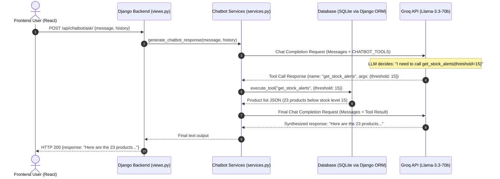

# Bizionary AI Chatbot Flow & Implementation Documentation

This document explains the detailed architecture, data flow, and code implementation of the Groq Function Calling (Tool Use) Chatbot in the Bizionary ERP system.

---

## 1. High-Level Architecture

The chatbot operates on an **Agentic RAG (Retrieval-Augmented Generation)** pattern. Instead of hardcoding prompt inputs or querying semantic vector stores (which is common for static PDF documents), the chatbot translates natural language questions into structured database queries on SQLite via Django ORM.



---

## 2. Core Concepts Explained

### 1. Large Language Models (LLMs)
The LLM (`llama-3.3-70b-versatile`) acts as the reasoning engine. It does not store the data itself (which would cause hallucinations or stale records). Instead, it decides *what action* to take and *how to explain* the results back to the user.

### 2. Retrieval-Augmented Generation (RAG)
RAG is the process of retrieving fresh information from a data source to ground the LLM's answers. In a relational database system (ERP), RAG is implemented by:
- Writing Python/Django helpers that fetch specific DB tables.
- Converting database model queries into clean serialized JSON strings.
- Feeding that JSON data directly to the LLM.

### 3. Function Calling (Tool Use)
Function calling allows you to describe your Python functions (name, description, parameters) to the LLM using JSON schemas. The LLM then outputs structured arguments instead of raw chat messages. 
For example, if you ask *"Find products matching Haier"*, the LLM recognizes that the query matches `search_products(query)` and returns:
```json
{
  "name": "search_products",
  "arguments": "{\"query\": \"Haier\"}"
}
```

---

## 3. Step-by-Step Code Walkthrough

The logic is housed entirely in the backend at [services.py](file:///c:/Users/Dell/Desktop/Fyp/chatbot/services.py).

### Step 1: Declaring the Tools (`CHATBOT_TOOLS`)
We define the exact structure of the functions the model can call. Each tool has a `description` that explains to the LLM *when* it should be invoked.

```python
CHATBOT_TOOLS = [
    {
        "type": "function",
        "function": {
            "name": "get_stock_alerts",
            "description": "Get a list of products that have low stock, or are below/less than a specific stock quantity threshold (e.g. stock less than 15, inventory under 10). Use this for any stock level comparisons.",
            "parameters": {
                "type": "object",
                "properties": {
                    "threshold": {
                        "type": "integer",
                        "description": "Maximum stock quantity threshold to check (e.g., 10)."
                    }
                }
            }
        }
    },
    {
        "type": "function",
        "function": {
            "name": "search_products",
            "description": "Search the product catalog by product name, SKU, or category to find active products and their details.",
            "parameters": {
                "type": "object",
                "properties": {
                    "query": {
                        "type": "string",
                        "description": "The name, category, or SKU query string to search for."
                    }
                },
                "required": ["query"]
            }
        }
    }
    # Additional tools: get_financial_kpis, get_unpaid_invoices, get_outstanding_payables, etc.
]
```

### Step 2: Implementing the Dispatcher (`execute_tool`)
This function acts as a router. When the Groq LLM returns a tool request, `execute_tool` executes the corresponding Django ORM query and converts the Django QuerySet into a JSON-serialized string.

```python
def execute_tool(name, arguments):
    import json
    try:
        if name == "get_stock_alerts":
            threshold = arguments.get("threshold")
            from products.models import Product
            from django.db.models import F, Q
            
            # If the user asked for stock less than X, query by stock_quantity
            if threshold is not None:
                products = Product.objects.filter(stock_quantity__lte=threshold).order_by('stock_quantity')
            else:
                # Default fallback for low stock
                products = Product.objects.filter(
                    Q(stock_quantity__lte=10) | Q(stock_quantity__lt=F('min_stock'))
                ).order_by('stock_quantity')
            
            # Slice results to prevent context overflow, but keep it high enough to show everything
            products = products[:50]
            
            if not products.exists():
                return "No products found meeting the low stock criteria."
                
            # Serialize fields clearly
            return json.dumps([
                {
                    "name": p.name,
                    "stock_quantity": p.stock_quantity,
                    "min_stock": p.min_stock,
                    "sku": p.sku
                } for p in products
            ])
            
        elif name == "search_products":
            # Direct search logic in DB
            ...
```

### Step 3: The Conversational Loop (`generate_chatbot_response`)
This handles the conversation loop with Groq.

1. **First LLM Call:** We call Groq's completions endpoint and pass both the conversation history and the `CHATBOT_TOOLS`.
2. **Tool Selection Check:** We inspect `response.choices[0].message.tool_calls`.
3. **Execution & Insertion:** If tools were requested:
   - We append the assistant's message requesting tool execution to the list of `messages`.
   - We run `execute_tool(name, arguments)` and receive the database results.
   - We append the results as a `tool` role message (with matching `tool_call_id`).
4. **Second LLM Call (Synthesis):** We send the updated list of `messages` back to Groq. The model sees the original question, the tool request, and the actual database JSON, and then writes the final response.

```python
def generate_chatbot_response(message, history=None):
    # Retrieve API Key
    api_key = _get_groq_api_key()
    client = Groq(api_key=api_key)
    
    # 1. Build messages history
    messages = build_chat_messages(message, history)
    model = _get_groq_model()
    
    # 2. Call Groq with tool definitions
    response = client.chat.completions.create(
        model=model,
        messages=messages,
        tools=CHATBOT_TOOLS,
        tool_choice="auto",
        temperature=0.7,
        max_tokens=1000,
    )
    
    response_message = response.choices[0].message
    tool_calls = getattr(response_message, 'tool_calls', None)
    
    # 3. Handle tool calling if requested by LLM
    if tool_calls:
        messages.append(response_message)
        
        for tool_call in tool_calls:
            tool_name = tool_call.function.name
            tool_args = json.loads(tool_call.function.arguments)
            
            # Execute database retrieval
            tool_result = execute_tool(tool_name, tool_args)
            
            # Append result with role='tool'
            messages.append({
                "role": "tool",
                "tool_call_id": tool_call.id,
                "name": tool_name,
                "content": tool_result
            })
            
        # 4. Call Groq again to synthesize the final answer
        response = client.chat.completions.create(
            model=model,
            messages=messages,
            temperature=0.7,
            max_tokens=1000,
        )
        content = response.choices[0].message.content.strip()
    else:
        content = response_message.content.strip()
        
    return content
```

---

## 4. Key Learnings & Engineering Takeaways

### 1. Context Truncation (`max_tokens`)
When returning large database outputs (like a list of 21 products), the final response will contain a lot of items. If `max_tokens` is set too low (e.g. 300-500 tokens), the model will run out of generation limit and cut off in the middle of a word. Setting `max_tokens=1000` is safer for listings.

### 2. Guardrails on Ambiguity
Llama-3 models can occasionally fail to format tool calls properly (throwing Groq Bad Requests with XML `<function=...>` outputs) if:
- The system prompt instructions conflict with dynamic function calling (e.g., trying to write tool calls inside code blocks).
- Multiple tools have overlapping scopes (like searching stock levels versus querying low stock).
- **The Fix:** We solved this by refining the tool descriptions to be completely distinct and writing explicit safety guardrails in the system prompt.

### 3. Development Fallbacks (Hybrid RAG)
In our implementation, we combined **Tool Use** with **Prompt Context Injection**. If the model fails tool validation, or does not select a tool, the backend still extracts the threshold (using regex patterns in python) and injects the results into the system prompt context anyway. This gives a double layer of defense so the LLM gets correct numbers no matter what.
